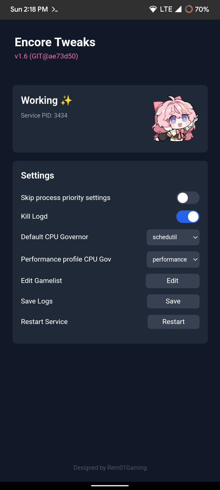

# Encore Tweaks
**Encore Tweaks**. A performance magisk module with automated performance profile.

## Features:
```
- Automatic performance script
- GUI Settings via KernelSU Module WebUI
- Three Performance profile: Performance, Normal, And Powersave
- Reduces Jitter and Latency
- Universal SoC Support
- Complete CPU, CPU Bus, GPU, and DRAM Frequency scaling for Snapdragon, Mediatek, Google Tensor, Exynos, and Unisoc
- Disables logd  service (if enabled in WebUI)
- Mediatek tailored parameter settings
- Schedulers, I/O and Network tweaks
- Disables SPI CRC
- Allows sched boosting on top-app tasks (Thx to tytydraco)
- Sets highest priority for Games
- Uses Google's schedutil rate-limits from Pixel 3
```

---

## How Encore Tweaks works under the hood
Encore Tweaks is fully automatic while comes to performance profile. Service will choose the profile according to this 3 rules:

### Performance Profile
Service will continuously checking any apps or games that listed on Gamelist and If user open any of it, service will apply performance mode. this included various kernel parameters, CPU, CPU Bus, GPU, and DRAM frequencies will be locked to highest possible OPP. This mode will be maintained until the user closes the game.

### Powersave Profile
If user enables battery saver mode (except while charging), service will apply powersave mode. powersave mode will lock CPU Bus, GPU, and DRAM frequencies to lowest possible OPP for saving power. ***This mode cannot override performance mode.***

### Normal Profile
If any of criteria on above not satisfied, service will apply normal mode. this mode will remove any restrictions and tweaks on other modes.

---

## WebUI module interface

Encore Tweaks exposes some settings inside WebUI. while Magisk Users can't access WebUI, you still can modify settings on `/data/encore/*`.

### Skip process priority settings
This will skip process priority settings (renice + ionice) by Encore Tweaks, leave this disabled if anything works fine.

### Kill Logd
As name suggests, this will kill logd service which is logging system in Android. enabling this will help reduce performance overhead.

### Default CPU Governor
CPU Governor that will used in Normal and Powersave profile.

### Performance profile CPU Gov
CPU Governor that will used in Performance profile.

### Edit Gamelist
Edit game and other performance intensive apps that will trigger Performance profile.

### Save Logs
Save `encore-service` logs into internal storage.

### Restart Service
Restart fresh `encore-service`.

---

## Notes:
- I don't recommend comboing this module with any performance modules except Thermal Mod.

## How to flash:
- Just flash in Magisk/KernelSU/APatch and reboot
- And that's it ;)

## How to Contribute:
- Fork the Repo
- Edit tweaks according to your info/docs
- Prettier the code using shfmt and clang-format (Google style)
- Commit with proper name and info/docs about what you did
- Test the change you did and check if eveything it's fine
- Then make a pull request

## Special Credits
- [tytydraco](https://github.com/tytydraco/KTweak) for KTweaks
- [NotZeetaa](https://github.com/NotZeetaa/YAKT) for YAKT
- [hoytech](https://github.com/hoytech/vmtouch) for vmtouch
- ~~[RiProG](https://github.com/RiProG-id) for App Monitoring~~
- [rsuntk](https://github.com/rsuntk) for arm32 support
- Our contributor
