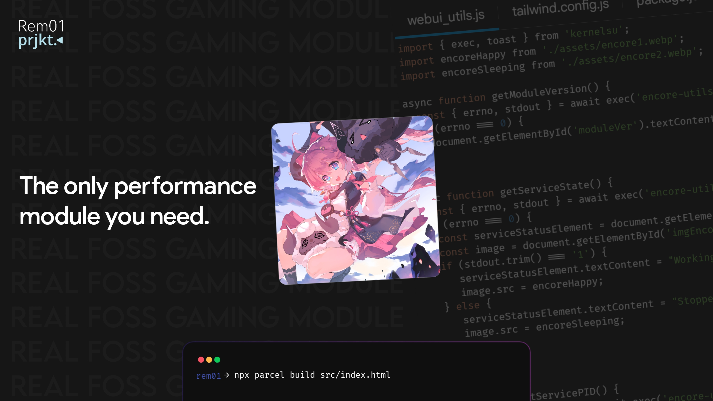

# Encore Tweaks
**Encore Tweaks**. A Performance Magisk module with AI features and various performance tweaks. This module applies at boot and automatically apply performance scripts automatically based on dumpsys.

## Features:
```
- Automatic performance script, based on dumpsys
- Three Performance mode: Performance, Normal, And Powersave
- Reduces Jitter and Latency
- Universal SoC Support
- Complete CPU, CPU BUS, GPU, and DRAM Frequency scaling for Snapdragon and Mediatek
- Disables printk and other logs
- Mediatek tailored parameter settings
- Schedulers, I/O and Network tweaks
- Disables SPI CRC
- Tweaks mglru
- Allows sched boosting on top-app tasks (Thx to tytydraco)
- Sets highest priority for Games and most essential processes
- Uses Google's schedutil rate-limits from Pixel 3
```

## How AI Feature works


## Notes:
- I don't recommend comboing this module with any gayming modules except Thermal Mod.

## How to flash:
- Just flash in magisk and reboot
- And that's it ;)

## How to Contribute:
- Fork the Repo
- Edit tweaks according to your info/docs
- Prettier the code using shfmt and clang-format (Google style)
- Commit with proper name and info/docs about what you did
- Test the change you did and check if eveything it's fine
- Then make a pull request

## Special Credits
- tytydraco for KTweaks
- NotZeetaa for YAKT
- RiProG for AI Feature
