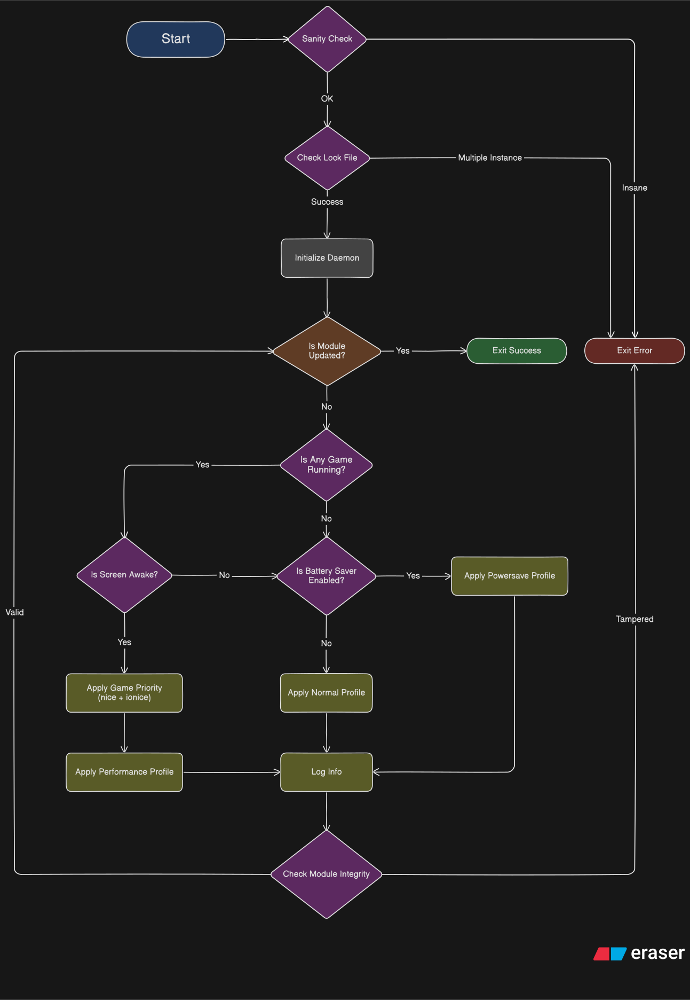

# Encore Tweaks Daemon

This are the core of Encore Tweaks that handles automatic profiles, configs and addons.

Before you digging into this code thinking this is some kind of scheduling module like Uperf, it's not. Encore Tweaks is a profile-style performance module, it simply applies performance tweaks as profiles and  <ins>do not dinamically control the scheduling and frequencies</ins>.

Encore Tweaks works by using information such as:
- Currently running app
- Screen state, whenever it's awake or not and...
- Battery saver state (yes the ones on your qs)

## Workflow diagram

